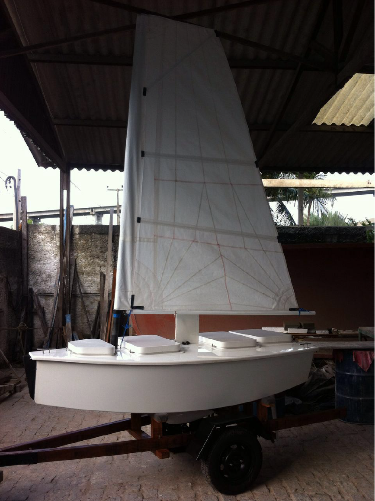

==========================
Nboat Documentation
==========================

About the project
-----------------

talk a little bit about the boats and the purpose of this document.

NatalNet -- UFRN
--------------------------------------

talk about NatalNet, link to the webpage

Summary
--------------------------------------

.. toctree::
   :maxdepth: 3
    
   source/our_sailboats/index
   source/nboat_mini/index
   source/nboat/index
   source/gnc/index
   source/water_sensor/index
   source/obstacle_detection/index
   source/simulation/index
   source/publications/index
   source/contributors/index

Disclaimer
----------

The purpose of this document is for the use of Nboat group only, but we open it in case it can be usefull for someone else.
Everything you find here is without absolutly no waranty and we're not responsible for any inconveniences or issues that might occurs. 

Feedback
--------

Don't hesitate to ask about some additional info or next guides and also if you find some mistakes, please let us know.
This can be done by submitting an issue or a push request on github.

