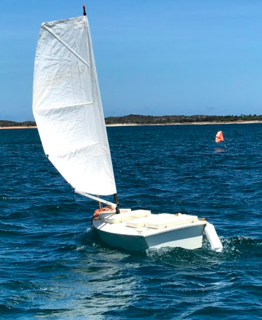

Sobre o projeto
---------------

A concepção do projeto Nboat se deu em meados de 2010, quando o então aluno de doutardo Rafael Aroca escreveu o projeto que foi submetido. A execução do projeto Nboat se deu de fato em meados de 2013, sendo coordenado pelo professor Luiz Marcos. Seu principal objetivo é desenvolver robôs de superfície aquática para serem usados como ferramenta educacional para aumentar o interesse na área de robôs móveis *outdoor* e, neste processo, formar recurso humano especializado no uso de robôs em tarefas de ajuda e preservação do ambiente aquático.

Além disto, as plataformas desenvolvidas podem ser usadas na coleta de dados para pesquisas sobre avaliação da qualidade e vigilância costeira nacional. Como objetivo secundário, o projeto prevê participação em competições de veleiros autônomos, como o IRSC, WRSC e o Microtransat Challenge, que promove a travessia do oceâno atlântico. Este projeto é financiado parcialmente pelo CNPq e CAPES.

A ideia deste documento é ser escrito de forma informal, na medida do  possível explicando como se estivesse conversando informalemente com alguém que não é especialista na área. Isto facilita o processo de escrita e também deixa o texto simples o que facilitar a leitura e entendimento por novos integrantes. Revisões gramáticais e explicações aprofundadas serão feitas no esquema incremental posteriormente.

A ideia aqui é centralizar os conhecimentos práticos obtidos no projeto, evitando que novos integrantes tenham que buscar essas informações nos artigos e dissertações, que por possuírem linguagem mais formal e recheada de teoria, acaba por desmotivar a leitura.

O texto deste documento fica na pasta /docs do branch nboat2 do repositório nboat. O documento é organizado por arquivos de texto que são simples de modificar e usam o padrão `Sphinx <https://www.sphinx-doc.org/pt_BR/master/usage/quickstart.html>`_. A atualiação da página web é feita automaticamente do repositório pelo sistema `ReadTheDocs <https://docs.readthedocs.io/en/stable/>`_.

NatalNet -- UFRN
----------------

Located in the UFRN (Federal University of Rio Grande do Norte, Brazil), the NatalNet Associated laboratories are comprised of many reseach groups. They are mainly focused in reseach involving computer vision, educational robotics and mobile robotics in general. For more details on NatalNet Laboratories see http://www.natalnet.br/home/.

.. toctree::
   :maxdepth: 2
   
   source/estrutura/index
   source/eletrica/index
   source/eletronica/index
   source/sensores/index
   source/experimentos/index
   source/publicacoes/index
   source/participantes/index

Disclaimer
----------

Documento para uso interno no pronjeto Nboat.

Feedback
--------

Se você quiser contribuir com o texto, ou achar algum erro ou algo que pode ser melhorado solicite acesso ao repositório https://github.com/Natalnet/nboat ou faça um pull-request no branch nboat2.