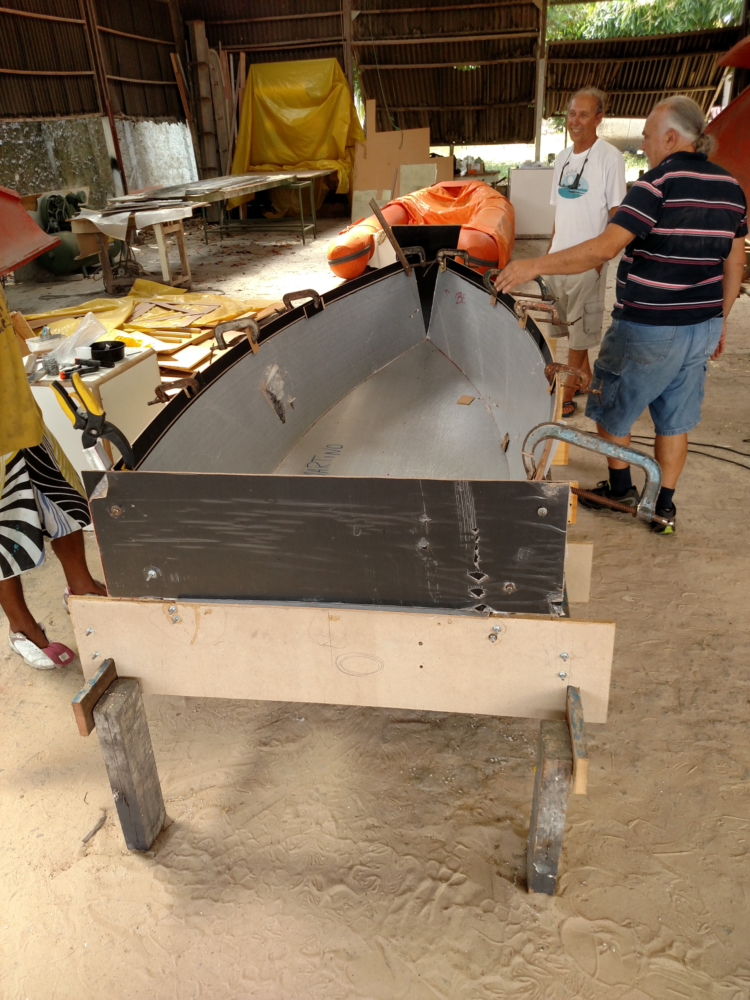
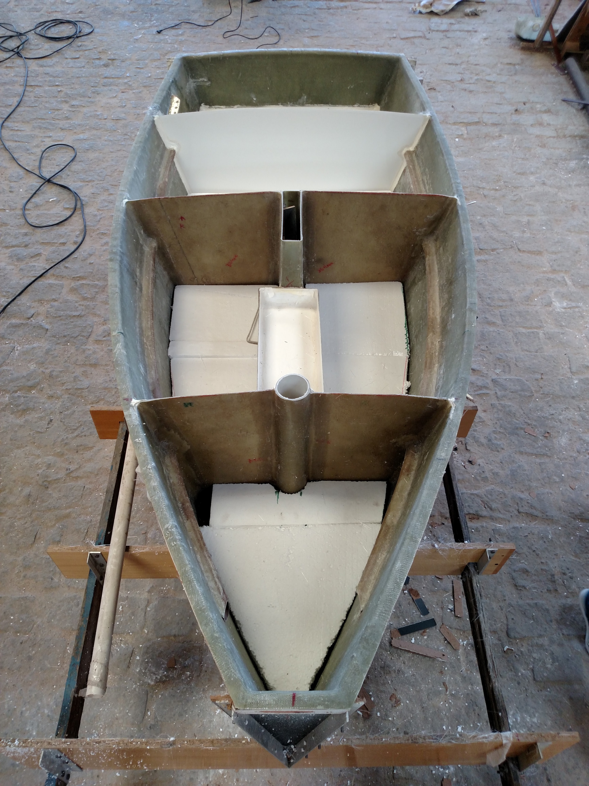
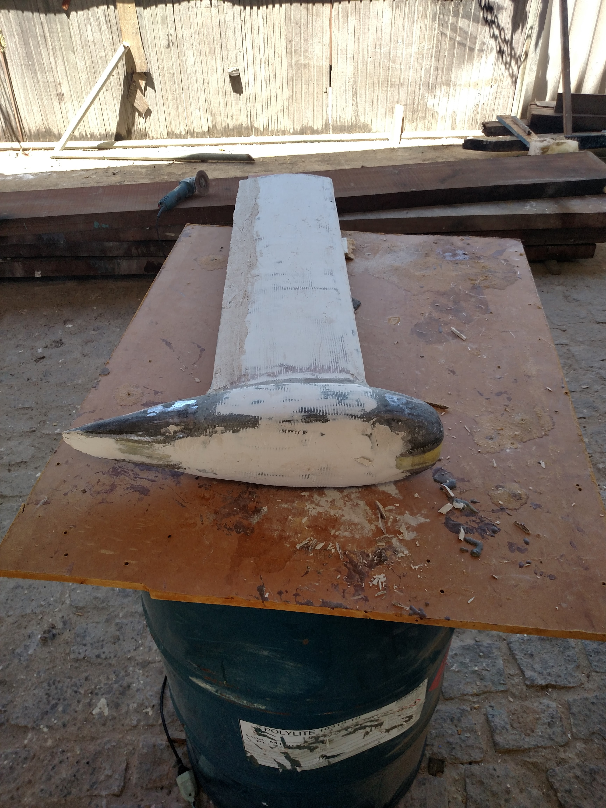
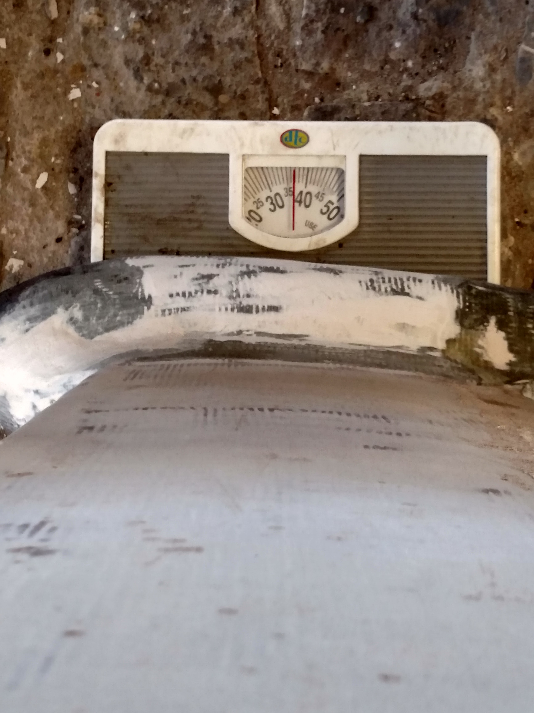
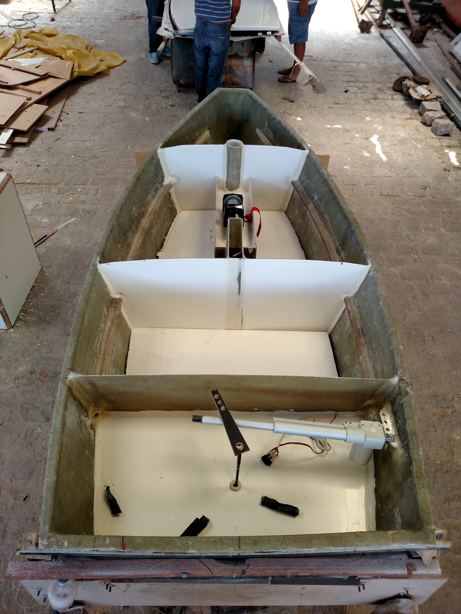
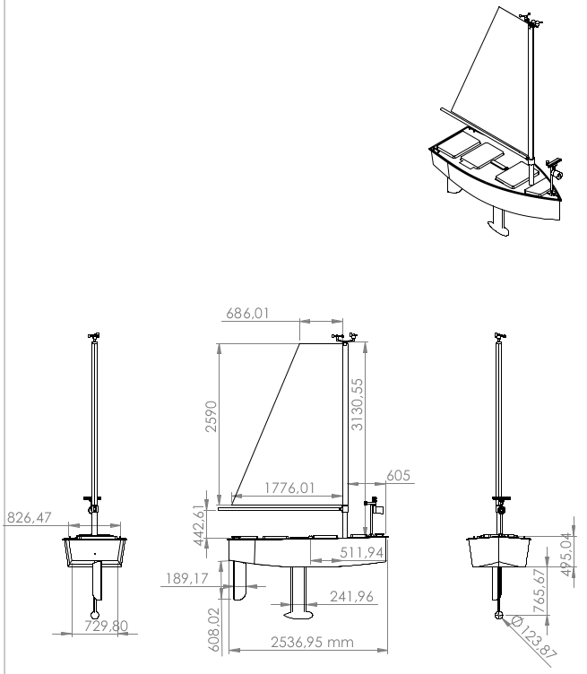
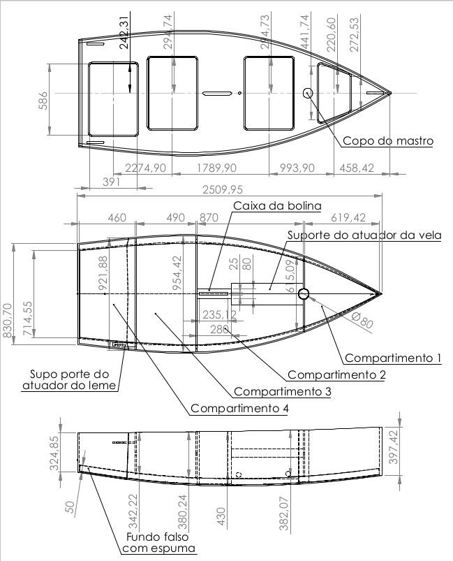

    .. _nboatmini:

============
Estrutura
============

.. talk about the fisical aspect of the robots and the challenges involved

Construção
----------

O veleiro Nboat II (será chamado de Nboat neste documento) foi construido em meados de 2015. O projeto estrutural do veleiro foi feito pelo Engenheiro naval Fred e sua construção foi comandada pelo Zeca, que tem uma oficina para construção e manutenção de embarcações nos arredores da Redinha.

O casco do veleiro possui 4 compartimentos, cada um vedado com tampas presas com parafusos para evitar a entrada de água. Os compartimentos são conectados lateralmente por tubos de pvc que servem para passar os fios de energia e dados.

A quilha do veleiro é lastrasda, ou seja, possúi um peso em sua extremidade para ajudar na estabilidade do veleiro. Ela pesa 37 Kg.

.. tip::
    A frente de uma embacarção é chamada de proa. A traseira se chama popa (vento em popa). O lado esquerdo da embarcação se chama Bombordo (lado do coração, que **bombeia** o sangue ;D) e a direita Estibordo ou Boreste.

Também foi construído o leme e a vela. O leme é uma espécie de quilha rotatória que fica na traseira do veleiro (popa) e é usado modificar o rumo da embarcação. A vela se conecta ao casco entre os compartimentos 1 e 2 e serve para captar a força dos ventos e dar velocidade ao veleiro. As dimensões de ambos podem ser vistos mais abaixo.

Atuadores
---------

Para mudar a posição da vela e do leme o veleiro Nboat usa um atuador linear (leme) e um mini-guicho (vela). O guincho fica no compartimento 2, próxima a vela, equanto o atuador linear pode ser visto na imagem abaixo dentro do compartimento 4.

Organização
-----------

Os compartimentos são númerados de 1 a 4, sendo o compartimento 1 aquele que fica mais a frente da embarcação e 4 o que fica mais próximo ao leme. Cada compartimento acolhe um tipo de equipamento, sendo, atualmente, o compartimento 1 contém o botão de emergência e as entradas dos sensores de vento e da buzina. O compartimento 2 fica com o sistema de atuação da vela e as baterias, além de relés para o sistema de seguraça da vela. O compartimento 3 fica com os processadores centrais e a caixa de disjuntores de distrubuição de energia. O compartimento 4 fica com o atuador do leme.

Montagem estrutural do veleiro
------------------------------

Por seu grande porte e peso dos equipamentos, a montagem do veleiro é demorada e precisa de pelo menos 4 pessoas, porém quanto mais melhor. A montagem consiste basicamente em acoplar a bolina, o leme e a vela. A montagem detalhada completa, com conexão dos fios de energia e calibragem da vela e do leme e passo-a-passo da montagem das partes será mostrada na seção experimentos.

A bolina é encaixada de baixo pra cima no casco, e sua parte superior possui 3 parafusos, que são encaixados na tampa da bolina e parafusados. O leme também é colocado de baixo pra cima no seu compartimento e internamente é parafusado a um braço de metal que encaixa no atuador linear. Para a vela, é preciso colocar o tecido no mastro e então amarra-lá à retranca, que é a haste que dá suporte horizontal à vela.

Dimensões e pesos
-----------------

Pesos
+++++

* baterias nauticas: 25,5 Kg.
* quilha: 37 Kg.
* casco: ~50 Kg.

O peso total do veleiro montado, com as baterias é aproximadamente 150Kgs.

Dimensões
+++++++++

