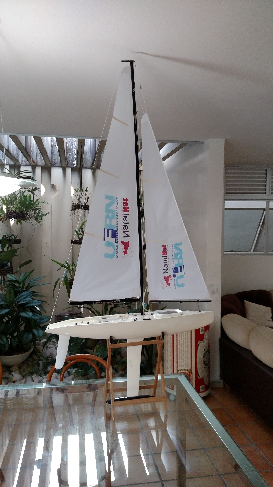

============
Experimentos
============

A primeira parte a ser montada é a bolina, devido ao seu peso elevado. Com o veleiro em cima da carroça de transporte, duas pessoas (ou mais) levantam o casco verticalmente enquanto outras duas (ou mais) posicionam a bolina no centro da carroça e alinham sua entrada. O casco é então descido lentamente, observando 

Para montar a vela é preciso primeiro por o tecido da vela no mastro. 

Talk about both sailboats and the project in general.

We are currently working on 3 different platforms: Nboat I, Nboat II and WQboat I, each used for different purpuses.

Nboat I
-------

This is the first water vehicle we worked with. In the beginnings of Nboat project our idea was to first develop a sailboat model in small scale and then test and validate the hardware, mainly compose of the microcontrollers and sensors, and software, composed of the navigation system and the movement control strategies.

So, our idea was instead of build a sailboat from zero, buy a commercial sailboat model and adapt it to support our needs. After that, we start developing a movement control strategy for a sailboat, so that, given a certain target position, the sailboat was able to get there on its own (autonomously). After that, we had to decide what kind of information this movement control needed to do his job, and then pick the appropriated sensors.

Small sailboat used for initial understanding of sailing control, sailboat movement and dynamics. This is an RC Moonsoon sailboat (https://hobbyking.com/en_us/monsoon-sailboat-1800mm-71-almost-ready-to-sail.html) adapted for robotics, where we modified the structure to add a waterproof compartiment and embaked the necessary eletronics for autonomous navigation.

WQboat
------

Small boat that we build. It uses a fan and and a rudder for its movement.

.. add image of wqboat

Nboat II
--------

After testing some of the methods for sailboat navigation in a reduced model we (and some financial problems) we finally started to build the 2 meters platform we would eventually use in real world applications.

Our ideal was to use the same eletronics, sensors and navigations techinches validated in the smaller platform with little to no changes in this bigger platform.

On its final form, the NBoat 2 should be able to navigate autonomously to desired points in the globe, being robust enough to support harsh environments such as strong winds and high waves, performing long term missions lasting several weeks or months, using solar power to charge its batteries. Thats our goal.

Below, we explain with details some of this journey of build such a complex robotic platform.

contracting experienced sailors, some with real world experience and the other with a more technical background.

2.5 meters long sailboat to be used in long term applicaions. The Nboat II has four waterproof compartiments and can carry 50 kg of payload (?).

.. image:: ./images/nboat2.png
    :scale: 50 %
    :align: center
    :alt: Nboat II.

Over the next chapters we dive in the construction, eletronics and software of our robots.