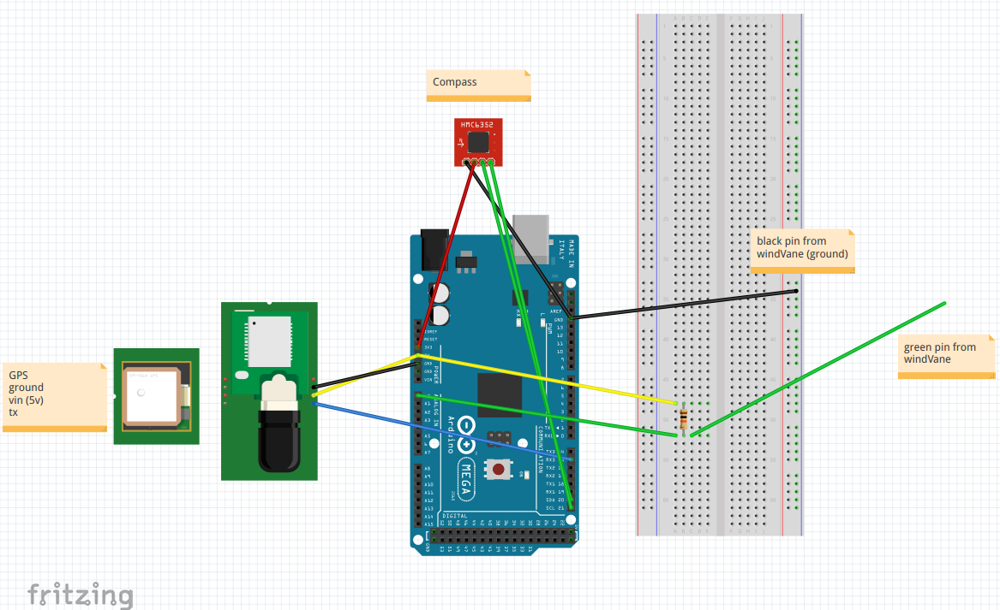

.. _nboatmini:

=========================
Nboat (Version 1.0)
=========================

In the begginings of Nboat project our idea was to first develop a sailboat model in small scale and then test and validate the hardware, mainly compose of the microcontrollers and sensors, and software, composed of the navigation system and the movement control strategies.

So, our idea was instead of build a sailboat from zero, buy a comertioal sailboat model and adapt it to suport our needs. After that, we start developing a movement contol strategy for a sailboat, so that, given a certain target position, the sailboat was able to get there on its own (autonomously). After that, we had to decide what kind of information this movement control needed to do his job, and then pick the appropriated sensors.

All this process is explain in details bellow.

Construction
--------

Electronics
--------

We decided to use the arduino as the main processing hardware in this prototyping phase and to integrate our system at this first moment. So we realized that the minimal necessary information to allow autonomous sailing were (at that time): position (GPS), current heading (compass or 9DOF IMU) and wind direction (wind vane) (latter we figured that control the sail angle could be done mecanically).

With these necessary informatiom, we started to develop our first and rudimentary autonomous sailing strategy. The idea was to constantly adjust the sailboat's heading (this is done by the rudder) and to get forward velocity (by adjusting the sail angle). Our first hipotesys was that if a sailboat does theses steps it will eventually reach a desired position. So, in this case the sailboat has two independt controllers: one for the sail, responsible for chosing the "right" sail angle so the sailboat gets some forward velocity; and one for the rudder, resposible for chosing the "right" rudder position so the sailboat follows a desired heading (the one that leads to the target point).

these two controllers were boiled down to the following equations:

.. code-block:: python 
  
    sailAngle = windDirection/2

    rudderAngle = headingError

where,

.. code-block:: python

    headingError = desiredHeading - currentHeading 

After implementing this control strategy we started setting up the hardware. We first tested every one of the sensors fisically, so the conections were correct and the sensors were ON, and by software, so the value read by the sensor is available for use in the code. After these individual tests we put them all togueter in the arduinomega, showed by the pin schematics bellow:

Testing
--------

After all, we took the boat to a nearby lagoon, called *Lagoa de Alcaçuz*, to perform some experimental tests. We hope to see if the whole system was working by picking a desired point in the lagoon and watching if the sailboat would be able to reach it on its own. The results of this experiment are shown in the video bellow.

.. raw:: html

    

            <iframe src="https://www.youtube.com/embed/vy302e11Tpc?start=390&end=508" frameborder="0" allowfullscreen style="position: absolute; top: 0; left: 0; width: 95%; height: 95%;"></iframe>
                

As you can see the sailboat reached the desired target, even under not ideal conditions, with high wind velocity and some timid waves.

Right after this test the concealment that we put on the sailboat was finally broken by the water and the sailboat stoped working properly.

Lessons learned
--------  

Some of it might seem obvious but...

* The sailing control startegy that we develop worked but it wasnt particulary robuts enough to allow sailing to points directly againts the wind (a zig-zaging maneuver called tacking/beating)

* If you're developing any navigation techiniques for a robot TEST IT FIRST IN SIMULATION. It will save you a lot of time

* If you're going to perform ANY outdoor experiment (specially in the water) CAREFULLY PREPARE you fucking robot and PLAN the fucking mission back to back. In this way you'll take the most out of the experiment
