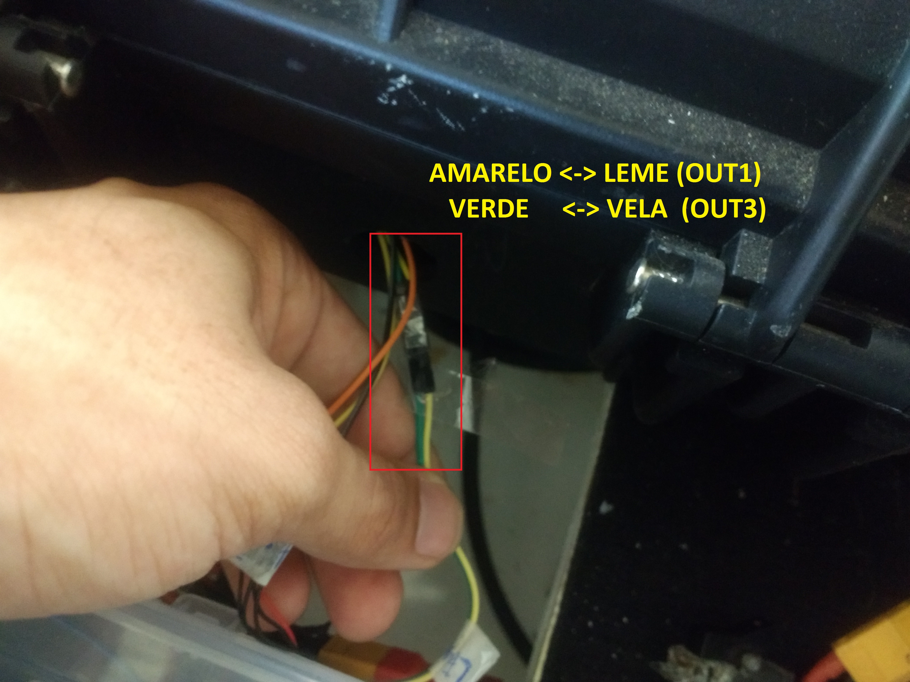
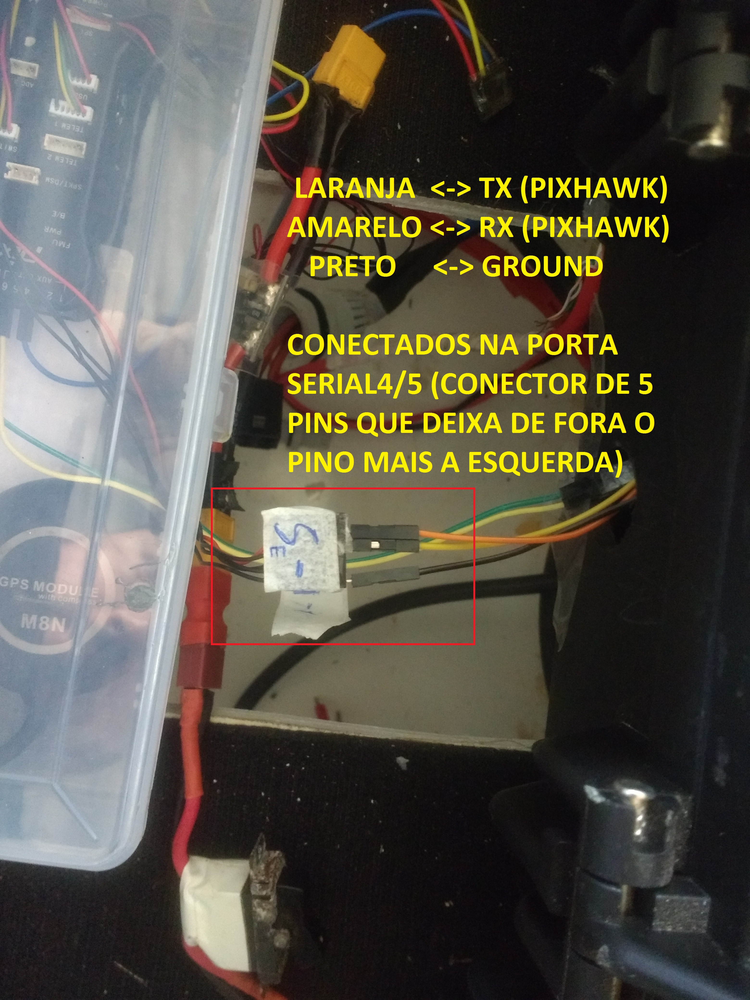
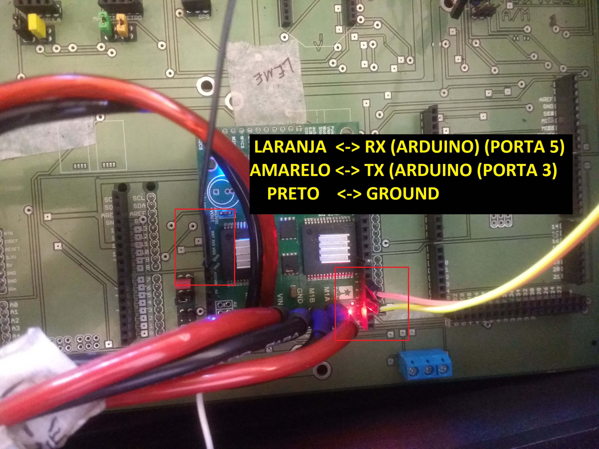
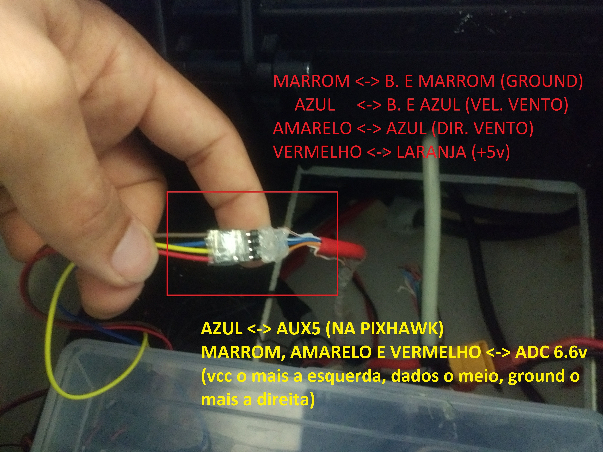
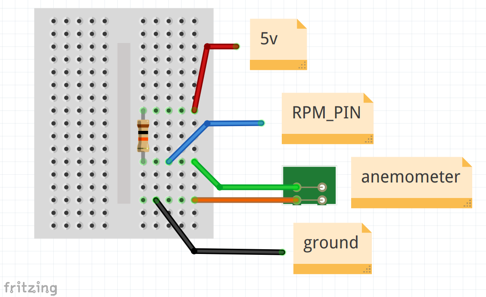

.. _water-sensors:

********
Sensores
********

Aqui é tratado a parte específica de montagem e conexões dos sensores.

Pixhawk
-------

A pixhawk, que está localizada no compartimento 3, deve receber sinais dos sensores e enviar comandos para os atuadores da vela e do leme. Os sensores padrão que vem no kit pixhawk são um GPS com IMU e o módulo de potencia, que calcula a tensão e corrente a fim de estimar o consumo total da bateria e a carga restante.

No esquema de conexão atual a pixhawk apenas envia os comandos PWM para a placa central, e o sistema implementado nela funciona como uma interface, que recebe um sinal de PWM, traduz para ângulo de vela e leme e comanda os atuadores para levar por a vela e o leme na posição desejada. Como há essa separação entre pixhawk e atuadores, a pixhawk não tem acesso a informações importantes como consumo e posição dos atuadores.

Desta forma, existe uma cominicação serial entre a pixhawk e o driver dos atuadores onde a pixhawk:

- Envia sinais de PWM;
- Recebe estado dos atuadores (consumo, posição, velocidade de rotação);

A conexão para envio de sinais de PWM é mostrada abaixo.

A conexão para comunicação serial é mostrada abaixo

A pixhawk também recebe os sinais do sensores do vento.

Sensores de vento
-----------------

O sensor de direção do vento é composto por um potenciometro de posição absoluta que rotaciona de acordo com a direção do vento. O sensor de velocidade do vento é um conjunto de copos que gira e fecha um circuito funcionando como um botão. O número de clicks indica a velocidade do vento.

A imagem abaixo mostra como os sensores do vento são conectados à pixhawk.

Algumas configurações na pixhawk são necessárias para os sinais lidos dos sensores de vento. Mais detalhes da configuração neste `post <https://discuss.ardupilot.org/t/sailboat-support/32060/506>`_.

Setup inicial da pixhawk
------------------------

O primeiro passo é encaixar os módulos que vem no kit pixhawk. Com a pixhawk em mãos e montada, baixe o `MissionPlanner <https://firmware.ardupilot.org/Tools/MissionPlanner/MissionPlanner-latest.msi>`_ e também o `QGroundControl <http://qgroundcontrol.com/>`_. Os dois são ground controls: softwares usados para ajudar a carregar o código na pixhawk, configurar os parâmetros, carregar missões e também acompanhar os dados de telemetria. Principalmente, eles serão usados para calibrar os sensores da pixhawk.

Algumas partes são mais fáceis de fazer no MissionPlanner e outras no QGroundControl, então é importante instalar os dois.

Carregando o firmware
=====================

O código fonte do firmware está em https://github.com/Natalnet/ardupilot.git, no branch nboat. Para compilar siga este `tutorial <https://ardupilot.org/dev/docs/building-setup-linux.html#building-setup-linux>`_ de *Setup On Ubuntu* até o comando *. ~/.profile*. Se tudo der certo, use os comandos **./waf configure --board Pixhawk1** e **./waf rover**. O firmware estará na pasta **ardupilot/build/Pixhawk1/bin** com o nome **ardupilot.apj**.

Instale o MissionPlanner ou o QGroundControl para carregar o firmware na pixhawk. Após carregar o firmware, carregue na pixhawk os parâmetros do arquivo da pasta **config_pixhawk/nboat_param**. Com isto, o código ardupilot modificado para o nboat estará rodando na pixhawk. Em outro menu será mostrado mais detalhes do código.

Calibrar o imu
==============

Esta parte é relativamente direta. Abra o missionplanner. Vá na aba 

Calibrar o rádio
================

Calibrar as saídas
==================

asdasdad

